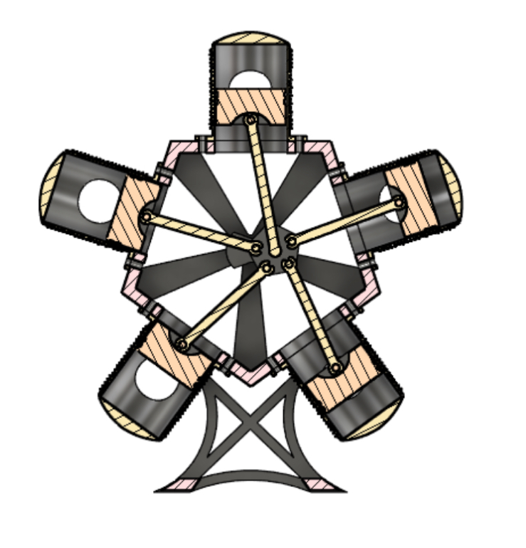

# STAR_ENGINE_MECHINERY
In this simulation, we will animate a star-engine mechanism which have 5 pistons and track the motion of its pistons as the central pentagon crank rotates around center. This exercise is based on concepts from mechanism design and kinematics, focusing on multi-degree-of-freedom linkages and their motion analysis. We will use MATLAB with SYMBOLIC MATH tool's box to construct the mechanism, scale the visual representation , and real time simulate the dynamic motion of the pistons and links.

## Features

### Visual Animation
-  **5 pistons** arranged in radial star pattern
-  **Rotating crank** and pentagon linkage system
-  **Color-coded pistons** with visible numbers (1-5)
-  **Green trajectory trails** tracking each piston's path
-  **Interactive speed slider** (0-50 rad/s)
-  **Central triangle** showing engine center
-  **Real-time rendering** with smooth 100 FPS animation

### Real-Time Graphs
| Plot | Description | Key Metrics |
|------|-------------|-------------|
| **Piston 1 Velocity** | Radial velocity profile | Current, Max, Min values |
| **All Pistons Velocity** | Comparative view of all 5 pistons | Color-coded with legend |
| **Crank Angular Velocity** | ω vs time | Real-time speed tracking |
| **Piston 1 Acceleration** | Using symbolic differentiation | Accurate physical simulation |

When completed, the simulation will be:

# Star Engine Simulation - Complete Code Walkthrough

**Step-by-step breakdown of a 5-cylinder radial star engine simulation**

[Code Flow](star_engine_v7_real.m) [Data Flow Diagram](Data_Flow_Diagram) 

---

## 🚀 Quick Start

